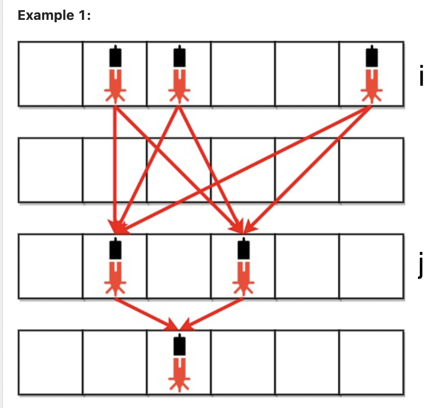

# January 3rd Question of the day
# 2125. Number of Laser Beams in a Bank Solution

Intuition:
I thought of this as a two pointer question, with each pointer pointing to a row at a time.

Let's look at our first example:

With each iteration, we count how many 1's we have in row i and row j.

The number of laser beams will be the product of these 2. We add this product to the total sum.

We then proceed to the next iteration by making i = j and incrementing j++.

*Edge Case*:

The only edge case here is when there's no 1's in row j. In this case, we need to keep our i row the same and only increment j++.

Notice that in case i's 1 count is 0, we could just normaly move to the next iteration with i = j and j++.